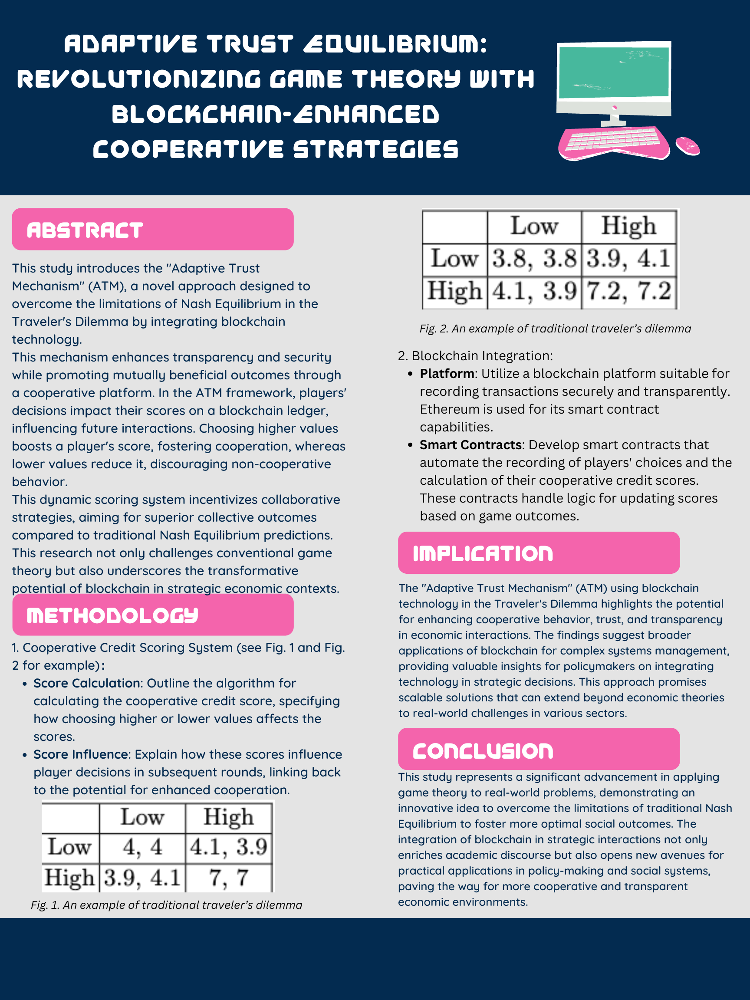

## Research Poster

## Overleaf
 - View-Only Overleaf: https://www.overleaf.com/read/syvpcwtgvnsx#6539d4

## Compiled PDF of Overleaf
 - [Compiled PDF](https://github.com/Rising-Stars-by-Sunshine/COMPSCI206_Final-Project_Long-Qian/blob/main/Proposal/Compiled%20PDF%20(v0)/Final_Project.pdf)

## Latex
 - [Zip File of Overleaf](Latex)

## Colab
 - [Colab](Colab)

## Description

### Summarize the Background/Motivation
- What are the gaps between the existing literature and the pressing social
and economic issues in the digital economy of complex system involving
both human and AI agent that inspires your research?

**Answer**:
### Research Questions
- What are the questions that your research intends to answer?

  **Answer**: My research seeks to propose an innovative mechanism that can be utilized to enhance cooperation in game-theoretic models and ensure higher collective payoffs in economic interactions to overcome the limitations of traditional concepts in game theory such as Nash Equilibrium.
- Why are the questions important?

  **Answer**: These questions are vital as they explore solutions to overcome inherent selfish strategies that lead to suboptimal outcomes in traditional game theory, aiming to foster a more cooperative and economically efficient environment.
- Why are the questions not answered by existing game theory literature?

  **Answer**: Traditional game theory often assumes static strategies and absolutely rational, which doesn’t perform well when faced with the complexities and uncertainties of real-world interactions. Existing theories also lack practical mechanisms that facilitate higher cooperation effectively.
### Application Scenario
- In which real-world situation does your newly proposed game and/or
solution concept or mechanism apply?

  **Answer**: The mechanism applies to scenarios such as online marketplaces, collaborative economy platforms, and digital negotiations, where trust and cooperation significantly influence the economic outcomes.
- What is the literature in other discipline such as psychology that could
provide a behavioral foundation of your newly proposed game and/or
solution concept, or mechanism?

  **Answer**: Psychological studies on trust, reciprocity, and social norms provide a behavioral foundation, emphasizing the importance of trustworthy environments and mutual benefits in influencing human decisions and cooperation levels.

### Methodology
- What is the key game theoretical or mechanism design framework that
you build upon?

  **Answer**: This mechanism is proposed to solve the limitations of traditional concepts in game theory such as Nash Equilibrium that the solution doesn't provide the optimal outcome for both player.
- What is the key computational or analytical tools that you apply to answer
your requestion question?

  **Answer**: I mainly used the package provided in Python called Nashpy, providing much convenience in calculating the Nash Equilibrium of metric games that helps me analyze the performance of my mechanism.
- What is the advanced technology or interdisciplinary insights that you
integrate into the existing methods that smartly solve your research
question?

  **Answer**: The integration of blockchain is the advanced technological insight, which adds a layer of security and transparency not previously available in game theory applications.

### Preliminary Results
- Can you provide a concrete illustration example of game theory or
mechanism design that your approach significantly improves at least one
objective of human welfare compared to existing research without your
approach?

  **Answer**: I propose a new mechanism with a cooperative credit system. This mechanism provides a cooperative platform, which updates the cooperative credit score in real time according to the choices made by each cooperative user. For example, if a user chooses a high value, then his cooperative credit score will increase, indicating that he is more inclined to cooperate to achieve a high yield together. Similarly, if the user chooses a low value, then his cooperative credit score will be reduced accordingly. In this way, although the user who chooses the low value gets a higher benefit in the current transaction, his points are reduced, and the probability of other users choosing to cooperate with him in the future is reduced, or choosing a lower value in the cooperation with him. Therefore, in the long run, users who tend to choose low value will not be very good. Applied with this mechanism,  the outcome for a single game is no longer merely the values they received but combined with the impact on their future  cooperation.  As a result, the modification mechanism encourages users to cooperate with each other and tends to select higher values, making the final result superior to nash equilibrium. For an illustration example, please check section 3 in my proposal.
### Intellectual Merits and Practical impacts of your project
- Can you demonstrate the limitation of your current research that would
inspire future research? For example, what are the other important
objectives of human welfare that you approach does not consider yet?

  **Answer**: While the current mechanism enhances cooperation, there is still an important question about how to design the credit system to make it reasonable and effective as expected. If not, it may mislead people's cooperation choices and not optimaze their outcomes. In my future study, I'll consider applying the power of AI. With machine learning technologies, I believe this mechansim can be much better and do more contributions in human welfare.
- Can you elaborate on how your research can be applied to improve
individual, company, and government decisions in strategic scenarios or
social choice issues?

  **Answer**: My research offers a practical framework for enhancing decision-making in various strategic interactions by ensuring higher levels of cooperation and trust, applicable in settings ranging from corporate negotiations to international trade agreements, promoting more sustainable and beneficial decisions across sectors.
